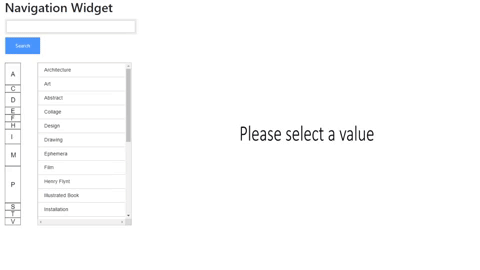

# Navigation Widget

This is a Navigation widget for large collection of files. This widget is made to provide an easy-to-use tool for the user that shows all the information available. Additionally, the files can be filtered, search and summarized, allowing users ti easily navigate and explore the files.



## Demo
[MoMA Collection](https://daviddlaiton.github.io/navigationWidget/) 

## Getting started
### Prerequisites

Firstly, you need to install nodeJS, the installer can be downloaded from: https://nodejs.org/es/
Be sure to select the install npm option and the addToPATH option during the installation process.

Checklist
```
NodeJS
```

Also, you need to run a local server environment. [Reload](https://www.npmjs.com/package/reload) it's recomended. 
It can be installed using this command in the command line:
```
$ npm install -g reload
```

Checklist
```
Reload
```
### How to run it
To get a copy of these project install git bash, open it from the command line and use 
$ git clone: https://github.com/daviddlaiton/navigationWidget.git

Then, open the root directory and run

```
$ reload
```
Then open your preferer browser and open localhost:8080

## Usage

TLDR
```html
<!DOCTYPE html>
  <!--CSS Bootstrap-->
  <link rel="stylesheet" href="https://stackpath.bootstrapcdn.com/bootstrap/4.1.3/css/bootstrap.min.css" integrity="sha384-MCw98/SFnGE8fJT3GXwEOngsV7Zt27NXFoaoApmYm81iuXoPkFOJwJ8ERdknLPMO"
    crossorigin="anonymous">
  <!-- Custom styles for this template -->
  <link href="css/widget.css" rel="stylesheet">
</head>
<body>

  <div class="container-fluid">
    <h1>Navigation Widget</h1>
    <div class="searchBar">
      <div id="content">
        <div id="searchfield">
          <form><input type="text" class="biginput" id="autocomplete"></form>
        </div>
        <button class="button" id="searchBarButton">Search</button>
      </div>

      <div id="outputbox">
        <p id="outputcontent"></p>
      </div>
    </div>
    <br>
    <div class="row">
      <div class="col-xl-4">
        <div class="row">
          <div class="col-xl-2">
            <canvas id="list" width="50" height="515" style="border:1px solid #d3d3d3;"></canvas>
          </div>
          <div class="col-xl-4">
            <ul class="subList" id="subList">
            </ul>
          </div>
        </div>
      </div>
      <div class="col-xl-4">
        
      </div>
    </div>
  </div>

  <!--D3 JS-->
  <script src="https://d3js.org/d3.v5.min.js"></script>

  <!--Bootstrap JS-->
  <script src="https://code.jquery.com/jquery-3.3.1.min.js" integrity="sha256-FgpCb/KJQlLNfOu91ta32o/NMZxltwRo8QtmkMRdAu8="
    crossorigin="anonymous"></script>
  <script src="https://cdnjs.cloudflare.com/ajax/libs/popper.js/1.14.3/umd/popper.min.js" integrity="sha384-ZMP7rVo3mIykV+2+9J3UJ46jBk0WLaUAdn689aCwoqbBJiSnjAK/l8WvCWPIPm49"
    crossorigin="anonymous"></script>
  <script src="https://stackpath.bootstrapcdn.com/bootstrap/4.1.3/js/bootstrap.min.js" integrity="sha384-ChfqqxuZUCnJSK3+MXmPNIyE6ZbWh2IMqE241rYiqJxyMiZ6OW/JmZQ5stwEULTy"
    crossorigin="anonymous"></script>

  <script type="text/javascript" src="js/jquery.autocomplete.min.js"></script>

  <!--JS of the Widget-->
  <script type="text/javascript" src="js/widget.js"></script>

  <script>
    var navigationWidget = widget("./data/data.json", 515, 50);
  </script>
</body>

</html>
```
### Step by step

1. Start with this template. This have all the external scripts and styles.

```html
<!DOCTYPE html>
  <!--CSS Bootstrap-->
  <link rel="stylesheet" href="https://stackpath.bootstrapcdn.com/bootstrap/4.1.3/css/bootstrap.min.css" integrity="sha384-MCw98/SFnGE8fJT3GXwEOngsV7Zt27NXFoaoApmYm81iuXoPkFOJwJ8ERdknLPMO"
    crossorigin="anonymous">
</head>
<body>

  <!--D3 JS-->
  <script src="https://d3js.org/d3.v5.min.js"></script>

  <!--Bootstrap JS-->
  <script src="https://code.jquery.com/jquery-3.3.1.min.js" integrity="sha256-FgpCb/KJQlLNfOu91ta32o/NMZxltwRo8QtmkMRdAu8="
    crossorigin="anonymous"></script>
  <script src="https://cdnjs.cloudflare.com/ajax/libs/popper.js/1.14.3/umd/popper.min.js" integrity="sha384-ZMP7rVo3mIykV+2+9J3UJ46jBk0WLaUAdn689aCwoqbBJiSnjAK/l8WvCWPIPm49"
    crossorigin="anonymous"></script>
  <script src="https://stackpath.bootstrapcdn.com/bootstrap/4.1.3/js/bootstrap.min.js" integrity="sha384-ChfqqxuZUCnJSK3+MXmPNIyE6ZbWh2IMqE241rYiqJxyMiZ6OW/JmZQ5stwEULTy"
    crossorigin="anonymous"></script>

  <script type="text/javascript" src="js/jquery.autocomplete.min.js"></script>
</body>

</html>
``` 

2. Create and import a new CSS file below the head. The file is in this repository in "css/widget.css".
```html
  <link href="css/widget.css" rel="stylesheet">
```

3. Create and import a new JavaScript file below the scripts (navigationWidget and jQuery autcomplete) or right in the html like in the example below. These files are in this repository inside the folder "js".

```html
  <script type="text/javascript" src="js/jquery.autocomplete.min.js"></script>
  <script type="text/javascript" src="js/widget.js"></script>
```

4. Follow this html. The first part has the searchbar part. The second one has the list. The third one has the sublist. In the div with id "selectedElement" will be shown the element selected by the user. The div element with id "outputbox" is used by the widget, so don't touch it. 

```html
<div class="container-fluid">
    <h1>Navigation Widget</h1>
    <div class="searchBar">
      <div id="content">
        <div id="searchfield">
          <form><input type="text" class="biginput" id="autocomplete"></form>
        </div>
        <button class="button" id="searchBarButton">Search</button>
      </div>

      <div id="outputbox">
        <p id="outputcontent"></p>
      </div>
    </div>
    <br>
    <div class="row">
      <div class="col-xl-4">
        <div class="row">
          <div class="col-xl-2">
            <canvas id="list" width="50" height="515" style="border:1px solid #d3d3d3;"></canvas>
          </div>
          <div class="col-xl-4">
            <ul class="subList" id="subList">
            </ul>
          </div>
        </div>
      </div>
      <div class="col-xl-4">
        
      </div>
    </div>
  </div>
```
5. Finally, set the widget and its attributtes below all the scripts. The firts attribute is where is located the data, the second one is the height and the third one is the width.

```html
<script>
    var navigationWidget = widget("./data/data.json", 515, 50);
</script>
```
## Built With

* [JavaScript](https://www.javascript.com/) - Language used.
* [NPM](https://www.npmjs.com/) - Dependency Management.
* [jQuery](https://jquery.com/) - A JavaScript libray used.


## Authors

* **Andrés David Laiton** - [daviddlaiton](https://github.com/daviddlaiton)

## License

This project is licensed under the MIT License - see the [LICENSE.md](LICENSE) file for details
